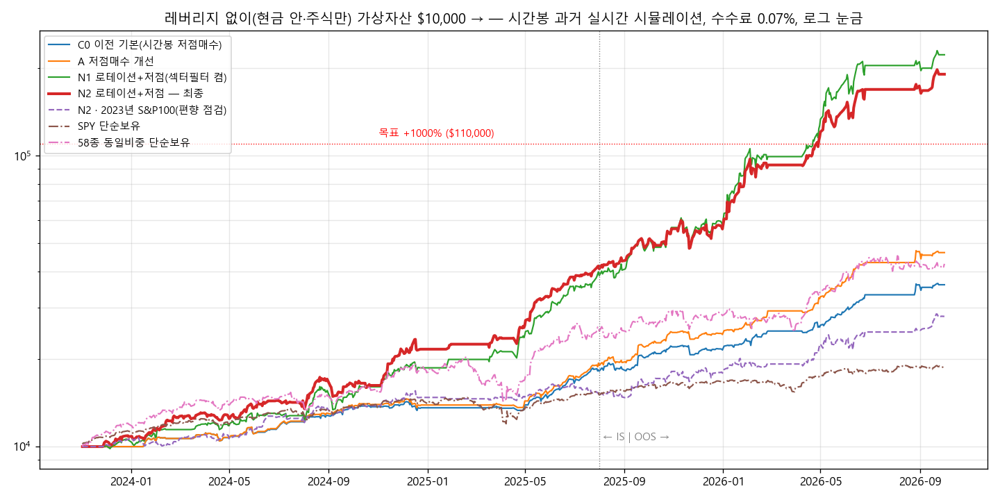

# 목표 +1000% 탐색 — 레버리지 없이 (2026-10-03)

## 1. 결론
- **조건**: 레버리지를 쓰지 않습니다.
  - 가상 신용 없이 현금 안에서만 사고, 최대 투자비중은 100%입니다.
  - 레버리지 ETF도 쓰지 않고 주식만 거래합니다.
- **목표**: 시뮬레이션 전체 기간(2023-11-02 ~ 2026-10-01, 약 2년 11개월) 누적 **+1000% 이상**.
  - 이는 연 128% 속도입니다. IS·OOS 각각 연 128% 이상도 요구했습니다.
- **최종 N2 — 모멘텀 로테이션 + 남는 현금 저점매수: +1,806%** ($10,000 → $190,553)
  - IS(2023-11 ~ 2025-07): +318%, 연 128.5%
  - OOS(2025-08 ~ 2026-10): +356%, 연 267%
  - MDD −19.9%, 샤프 3.13, 청산 972회, 손익비 4.41
  - 미리 정한 목표를 모두 넘었습니다.
  - 비교: SPY +87%. 같은 58종을 같은 비중으로 사서 들고만 있었으면 +325%.
- **견고성**: 12가지 조건 중 11가지에서 +1000% 이상을 유지했습니다.
  - 유니버스를 무작위로 반씩 나눠도 +1,097% / +1,275%였습니다.
  - 예외: M 국면 모델 대신 SPY 규칙을 쓰면 +680%, MDD −38%입니다.
- ⚠️ **같은 N2를 2023년 말 S&P 100 종목에 돌리면 +180%입니다**(MDD −10.9%, 샤프 1.86 / SPY +87%, 샤프 1.49).
  - N2 실현이익의 **84%가 SNDK·MU·WDC·STX·CRDO 5종목**에서 나왔습니다(이 기간 메모리·AI 급등주, 2026년에 고른 유니버스).
  - 로직은 시장보다 낫지만, 1000%는 '이 종목들을 미리 알고 고른 효과'가 큽니다(7절).

## 2. N2 로직 (`PRESETS["N2"]`)
1. **모멘텀 로테이션(자금의 핵심)**
   - 5거래일마다 전일 종가 기준 **126일(약 6개월) 수익률 상위 5종**(수익률이 양수인 종목만)을 고릅니다.
   - 각 20%씩 보유합니다. 순위 밖으로 밀린 종목은 다음 날 장 시작에 팔고, 새로 들어온 종목을 삽니다.
2. **남는 현금은 시간봉 저점매수**(기존 C0 규칙)
   - 매수: RSI ≤ 30 또는 볼린저 하단 → 저점 대비 +0.5% 반등
   - 매도: +3% 뒤 고점 대비 −1% 익절, −4% 손절, 최대 5일
   - 종목당 하루 2회까지, 최대 8종목
3. **M 국면은 켜기·끄기로만 사용**
   - 목표비중이 0이면 로테이션 종목을 모두 팔고 새로 사지 않습니다.
   - 0보다 크면 정해진 비중을 전부 사용합니다.
4. 이전 C0와 다른 점: S 섹터 필터·50일선 필터 끔, 일일 손실한도 끔.
5. 실현이익 구성:
   | 구분 | 거래 수 | 실현이익 |
   |---|---|---|
   | 로테이션 | 168회 | $172,200 |
   | 저점매수 | 804회 | $4,988 |

   **수익의 대부분은 로테이션**에서 나왔습니다. 저점매수는 쉬는 현금을 조금 굴리는 역할입니다.

## 3. 탐색 과정 (레버리지 없이 6라운드, 80개 변형)
| 라운드 | 시험한 것 | 결과 |
|---|---|---|
| Y01 저점매수 개선 | 종목당 2회, 손실한도 끔, 비중 30·40%, 국면 켜기·끄기, 변동성 맞춤 폭 | 최고 +455%. **A**(2회·손실한도 끔)는 +364%에 샤프 3.51로 위험 대비 최고. 변동성 맞춤은 IS 악화 |
| Y02 새 로직: 모멘텀 로테이션 | 상위 3·5·10종, 21·63·126일, 주기 5·21일, 손절, 국면 | 63일 상위 5종 +546%. **M 켜기·끄기로 +966%**. S&P100에서도 +123 ~ 180%(시장보다 좋음) |
| Y03 로테이션 조합 | 126일, 상위 3·4, 주기 3·10일, 섹터·50일선 끔, 손절, +저점매수 | 처음으로 1000% 넘음: 126일 +1,049%, +저점 +1,051% |
| Y04 126일 중심 조합 | +저점, 50일선 끔, 상위 4, 100·150일 | **50일선 끔 + 저점 = N1 +2,123%**(IS 연 122%) |
| Y05 N1 견고성 | 경로·비용·절반·SPY 국면·이웃·S&P100 | 18개 중 16개 유지. 절반 a +538%로 약함. **섹터 끔이 IS 연 128.5%로 모든 목표 통과 → N2** |
| Y06 N2 견고성 | 아래 표 | 12개 중 11개 유지 |

※ 그 전에 시험한 가상 신용(2~3배)·레버리지 ETF 결과(X02 ~ X08)는 사용 금지 지시에 따라 후보에서 뺐습니다.

## 4. N2 견고성 (Y06)
| 조건 | 전체 수익 | MDD | IS 연환산 | OOS 연환산 |
|---|---|---|---|---|
| **N2 기준** | **+1,806%** | −19.9% | 128% | 267% |
| 봉 안 순서: 항상 고가 먼저(불리) | +1,910% | −16.5% | 113% | 327% |
| 봉 안 순서: 무작위 | +1,511% | −15.3% | 94% | 304% |
| 수수료 0.15% | +1,586% | −19.6% | 117% | 258% |
| 슬리피지 0.15% | +1,508% | −19.1% | 107% | 267% |
| 유니버스 무작위 절반 a / b | +1,097% / +1,275% | −15.2% / −16.7% | 74% / 154% | 270% / 137% |
| 모멘텀 100일 / 150일 | +1,365% / +1,869% | −20.4% / −18.4% | 89% / 116% | 288% / 310% |
| 상위 4종 | +2,244% | −21.0% | 146% | 293% |
| 10거래일마다 | +1,674% | −19.7% | 124% | 255% |
| **M 국면 대신 SPY 규칙** | **+680%** | **−38.0%** | 45% | 234% |
| **2023년 S&P 100 종목** | **+180%** | −10.9% | 27% | 69% |

## 5. 분기별 수익률 (%)
| 분기 | C0 | A | **N2** | N2·S&P100 | SPY | 58종 동일비중 보유 |
|---|---|---|---|---|---|---|
| 2023Q4 | 0.0 | 0.0 | 8.2 | 6.1 | 12.9 | 19.5 |
| 2024Q1 | 9.7 | 9.7 | 20.3 | 3.2 | 10.4 | 20.7 |
| 2024Q2 | 4.4 | 5.0 | 10.6 | 15.0 | 4.4 | 1.2 |
| 2024Q3 | 19.2 | 20.7 | 13.9 | 9.6 | 5.8 | 6.2 |
| 2024Q4 | −0.5 | 0.0 | 31.9 | 6.9 | 2.5 | 16.0 |
| 2025Q1 | 0.4 | 0.4 | 9.5 | 0.9 | −4.3 | −9.6 |
| 2025Q2 | 24.5 | 25.1 | 61.7 | 10.8 | 10.8 | 59.0 |
| 2025Q3 | 19.8 | 27.0 | 30.2 | −0.3 | 8.1 | 1.2 |
| 2025Q4 | 5.5 | 9.6 | 12.3 | 8.8 | 2.7 | 7.9 |
| 2026Q1 | 16.2 | 20.5 | 66.0 | 7.4 | −4.4 | −8.4 |
| 2026Q2 | 33.2 | 46.7 | 81.8 | 28.8 | 15.1 | 72.7 |
| 2026Q3 | 8.3 | 8.2 | 12.8 | 13.2 | 2.4 | −7.2 |

## 6. 지금 쓸 수 있는 전략 (`STRATEGY`)
모두 레버리지가 없습니다. 실행기는 신용 배율이 1이 아니거나 레버리지 ETF가 대상에 들어 있으면 멈춥니다.

| 이름 | 내용 | 과거(58종) | 2023년 S&P100 |
|---|---|---|---|
| **N2** (기본) | 126일 모멘텀 상위 5종 로테이션 + 남는 현금 저점매수 | +1,806%, MDD −20% | +180%, MDD −11% |
| A | 시간봉 저점매수 개선 | +364%, MDD −7% | +81%, MDD −7% |
| C0 | 이전 기본값 | +260%, MDD −7% | +74%, MDD −7% |

## 7. 꼭 알아야 할 한계
1. **사후 선택 편향이 가장 큽니다.**
   - 58종 유니버스는 2026년에 고른 종목입니다. 같은 비중으로 들고만 있어도 +325%였습니다.
   - 모멘텀 로테이션은 그중 급등주(SNDK ×37, MU ×16, CRDO ×15 등)를 오래 들고 가서 1000%를 넘겼습니다.
   - 시작 시점에 정해진 S&P 100에서는 +180%입니다. 앞으로의 기대치는 이 숫자에 더 가깝다고 보는 것이 안전합니다.
2. **M 국면 모델 의존**:
   - M을 단순 SPY 규칙으로 바꾸면 MDD가 −38%로 커집니다.
   - M은 이 기간을 보며 다듬은 모델이라 실제보다 좋아 보일 수 있습니다.
3. **집중 위험**: 로테이션은 한 번에 5종을 20%씩 듭니다. 한 종목의 갭 하락이 자산 전체에 크게 영향을 줍니다(손절 없음, 다음 리밸런싱이나 국면 0일 때 매도).
4. **데이터**: 시간봉과 봉 안 경로 가정을 썼습니다. 로테이션은 일봉 신호라 경로 가정의 영향이 적습니다.
5. **지금은 M 목표비중이 0입니다**(2026-09-23부터). `signals/`를 갱신하기 전까지 가상거래는 아무것도 사지 않고 기다립니다.

## 8. 파일
- `1000pct_무레버리지_결과.xlsx`: 차트, Y 라운드 표, 자산곡선, 분기 수익률, N2 종목별·방식별 손익, N2 설정, N2 거래내역
- `자산곡선_무레버리지.png`
- `Y01_dip_nolev/` … `Y06_robust_N2/`: 변형마다 `*_trades.csv`, `*_equity.csv`, `*_summary.json`
