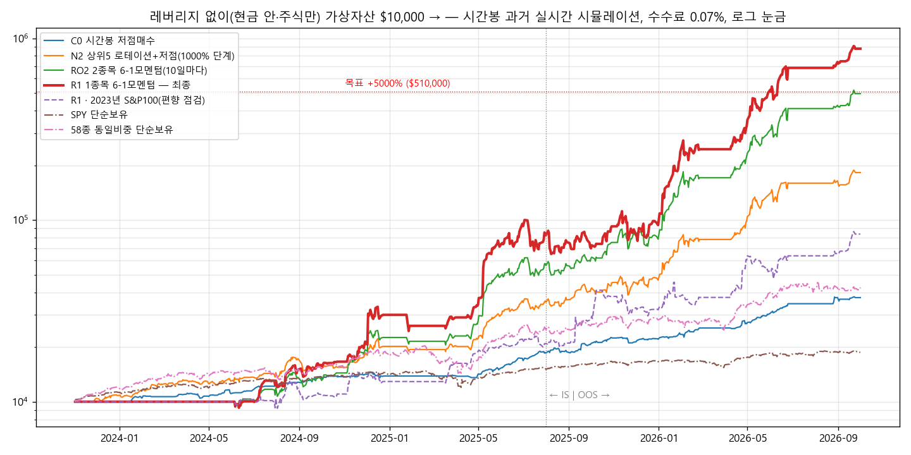

# 목표 +5000% 탐색 — 레버리지 없이 (2026-10-04)

## 1. 결론
- **목표**: 시뮬레이션 전체 기간(2023-11-02 ~ 2026-10-01) 누적 **+5000% 이상**.
  - 조건: 레버리지 없음(현금 안에서만, 주식만), 수수료 0.07%.
- **최종 R1: +8,661%** ($10,000 → $876,131)
  - 로직: 6-1 모멘텀(126일 수익률에서 최근 21일 제외) **1위 1종목에 전액**.
  - 2위 안에 있으면 계속 보유하고, 5거래일마다 장 시작 가격에 교체합니다.
  - M 국면이 0이면 현금으로 둡니다.
  - IS(~2025-07): +738%, 연 242% / OOS(2025-08~): +946%, 연 648%
  - MDD **−35.0%**, 샤프 2.47, 청산 26회, 승률 69%
- **견고성**: 12가지 조건 중 10가지에서 +5000% 이상이었습니다.
  - 수수료·슬리피지 0.15%: +8,240 ~ 8,310%
  - 모멘텀 기간·제외 일수·주기·버퍼를 바꾼 7가지 모두: +5,487 ~ 10,123%
  - 장 시작 가격에 사고팔아 봉 안 가격 순서 가정과 결과가 무관합니다.
- ⚠️ **꼭 함께 봐야 할 숫자**
  | 조건 | 결과 |
  |---|---|
  | 2023년 말 S&P 100 종목 | **+737%** (MDD −28%), SPY +87% |
  | 유니버스 무작위 절반 a | +1,415% |
  | M 국면 대신 SPY 규칙 | **+368%, MDD −61%** |
  | 이익 구성 | **75%가 SNDK 한 종목**(2026년 +$649k). 7종목에서 26번 거래 |

  → 5000%는 **2026년에 고른 58종 안에 SNDK·MU 같은 급등주가 들어 있어서** 나온 숫자입니다. 앞으로도 이만큼 나온다고 기대하면 안 됩니다. 한 종목에 전액이라 MDD −35%가 실제로는 더 클 수 있습니다.

## 2. 이번에 고친 엔진 결함
- 기존에는 이상 틱 필터가 ±30% 밖 가격을 무시했습니다.
  - 진짜 큰 갭(CRDO +35%, AMD +38%, ORCL +32%, INTC −26% 등 12종목)이 오면, 그 뒤 가격을 계속 버렸습니다.
  - 그 결과 해당 종목 가격이 **영원히 멈춰** 있었습니다.
- 지금은 같은 수준의 가격이 3번 이어지면 진짜 갭으로 받아들입니다.
- 이 수정으로 이전 결과가 바뀌었습니다.
  | 전략 | 수정 전 | 수정 후 |
  |---|---|---|
  | C0 | +260% | **+274%** |
  | A | +364% | **+369%** |
  | N2 | +1,806% | **+1,724%** |
- 실시간 가상거래에도 같은 결함이 있었는데, 같이 고쳐졌습니다.

## 3. 탐색 과정 (7라운드, 118개 변형)
| 라운드 | 시험한 것 | 결과 |
|---|---|---|
| Z01 | 로테이션 집중(상위 1·2·3), 버퍼, 주기, 모멘텀 기간, 샤프 점수 | 상위 2종목 +4,463%. 상위1의 이상한 결과(OOS 0%)로 **갭 결함 발견** |
| Z02 | 결함 수정 후 다시 기준 잡기 | 상위2 +4,357%, 상위1 +4,505% |
| Z03 | 상위2: 모멘텀 기간, 최근 k일 제외, 국면 0 보유 유지, 점수, 버퍼 | **최근 21일 제외(6-1 모멘텀) +6,352%** |
| Z04 | 그 후보(Q1) 견고성 | 봉 안 가격 순서만 바꿔도 +2,877 ~ 3,826% → 운 좋은 경로 |
| Z05 | 후보별 경로 4가지 중앙값 비교 | 중앙값 최고 +4,228% — 5000% 미달 |
| Z06 | **장 시작 가격에 사고팔기**(경로 가정과 무관) | 2종목·10일마다 +4,856%, **1종목·버퍼2 +8,661%** |
| Z07 | 1종목(RO1)·2종목(RO2) 견고성 | RO1이 12가지 중 10가지에서 5000% 이상 유지 |

## 4. 지금 쓸 수 있는 전략 (`STRATEGY`, 모두 레버리지 없음)
| 이름 | 내용 | 과거(58종) | 2023년 S&P100 |
|---|---|---|---|
| **R1** (기본) | 6-1 모멘텀 1위 1종목에 전액 | +8,661%, MDD −35% | +737%, MDD −28% |
| N2 | 126일 모멘텀 상위 5종 + 남는 현금 저점매수 | +1,724%, MDD −21% | +159%, MDD −10% |
| A | 시간봉 저점매수 개선 | +369%, MDD −7% | — |
| C0 | 이전 기본값 | +274%, MDD −7% | — |

- 위험을 줄이려면 N2가 낫습니다(5종목 분산, MDD −21%).
- 2종목 버전(RO2, +4,856%, MDD −22%)은 프리셋에 없습니다. 연구 결과로만 남겼습니다.

## 5. 분기별 수익률 (%)
| 분기 | C0 | N2 | RO2 | **R1** | R1·S&P100 | SPY |
|---|---|---|---|---|---|---|
| 2024Q2 | 4.4 | 4.2 | 2.0 | 0.9 | 2.4 | 4.4 |
| 2024Q3 | 19.2 | 16.2 | 31.0 | 57.8 | 7.1 | 5.8 |
| 2024Q4 | 1.4 | 26.9 | 68.9 | 88.9 | 17.9 | 2.5 |
| 2025Q1 | 0.4 | 0.9 | 2.1 | −3.4 | 26.1 | −4.3 |
| 2025Q2 | 24.7 | 76.3 | 163.1 | 227.9 | 35.8 | 10.8 |
| 2025Q3 | 18.9 | 12.6 | −2.2 | −25.7 | 27.3 | 8.1 |
| 2025Q4 | 7.0 | 15.3 | 32.2 | 32.4 | 13.8 | 2.7 |
| 2026Q1 | 15.4 | 67.6 | 117.9 | 161.5 | 16.9 | −4.4 |
| 2026Q2 | 36.0 | 104.1 | 140.3 | 180.3 | 69.4 | 15.1 |
| 2026Q3 | 8.0 | 14.4 | 20.7 | 27.5 | 31.7 | 2.4 |

※ R1은 모멘텀 계산에 일봉 148일이 필요해서 시뮬레이션 첫 7개월(2023-11 ~ 2024-05)은 거래가 없습니다. 실시간에서는 시작할 때 야후 일봉 2년치를 받아 바로 계산합니다.

## 6. 한계
1. 사후 선택 편향(1절)
2. 한 종목 집중 — 개별 악재(실적 쇼크, 갭 하락)에 손절 없이 노출됩니다. 다음 리밸런싱이나 국면 0일 때만 팝니다.
3. M 국면 모델 의존 — 이 기간을 보며 다듬은 모델입니다.
4. 거래 26회 — 통계적으로 근거가 약합니다.
5. 지금 M 목표비중이 0(2026-09-23부터)이라 `signals/`를 갱신하기 전까지 가상거래는 현금으로 대기합니다.

## 7. 파일
- `5000pct_결과.xlsx`: 차트, Z 라운드 표, 자산곡선, 분기 수익률, R1 종목별 손익, 설정, 거래내역
- `자산곡선_5000pct.png`
