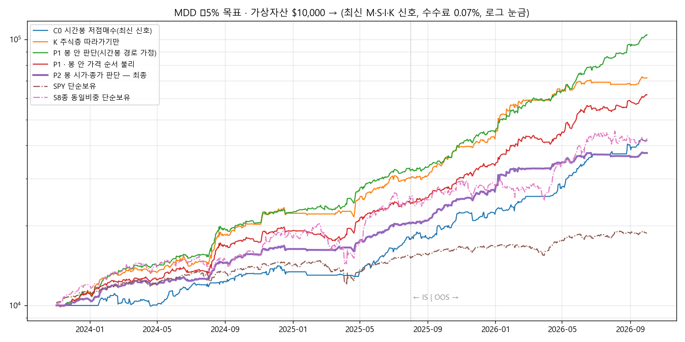

# MDD −5% 이내 · 거의 매일 거래 · 수익 최대 — 탐색 보고서 (2026-10-04)

## 1. 결론
- **조건**
  - 전체·IS·OOS 모든 기간의 MDD가 −5% 이내
  - 거래한 날이 IS·OOS 각각 80% 이상
  - 레버리지 없음, 수수료 0.07%
  - 신호는 **최신 버전** M v1.83 · S v0.98 · I v0.63 · K v0.31
- **최종 P2: +274%** ($10,000 → $37,424, 2023-11 ~ 2026-10)
  - MDD −4.93%, 샤프 3.33, 거래일 86%
  - IS +104%(MDD −4.9%) / OOS +83%(MDD −4.2%)
  - SPY는 +87%(MDD −19%)
- **이 숫자를 믿을 수 있는 이유**: 봉 안 가격 순서를 어떻게 가정해도, 5분봉으로 돌려도 결과가 같습니다(4절).
- ⚠️ **처음 찾은 P1(+943%, MDD −4.2%)은 쓰면 안 됩니다.**
  - 시간봉 안의 가격 경로 가정 덕분에 생긴 수익이었습니다.
  - 같은 기간 5분봉에서 +20%였던 수익이 **+1.7%**로 줄고, MDD가 −5.2%였습니다.
- **수익의 원천**:
  | 구분 | 실현이익 | 역할 |
  |---|---|---|
  | K 주식층 따라가기 | $27,070 | 수익의 거의 전부 |
  | 저점매수·국면0 당일거래 | $354 | 매일 거래를 만드는 정도(수익 기여 거의 없음) |

## 2. P2 로직 (`PRESETS["P2"]`, 실행 셀의 `STRATEGY="R1"`도 P2로 실행)
1. **K 주식층 따라가기**
   - 최신 주식층 리포트의 `13c_일별배분비중`을 씁니다(전날까지 확정된 값).
   - 종목별 비중 × 0.7만큼 보유합니다.
   - 장 시작 가격에 사고팝니다. 목표 금액과 10% 넘게 차이 나면 매일 장 시작에 맞춥니다.
2. **저점매수**(1회 자산의 4%, 종목당 하루 3회까지)
   - 시간봉 RSI ≤ 30 또는 볼린저 하단 → 반등에 삽니다.
   - 판단은 **매시 정각 시가와 봉 마감 종가에서만** 합니다.
3. **국면(M) 0인 날**: K는 전부 현금입니다. 저점매수만 절반 금액으로 그날 안에 사고팝니다.
4. **위험 관리**
   - 시장 급락 스위치: SPY가 전일 대비 −1%면 새로 안 사고, −1.5%면 저점매수 보유분을 팝니다.
   - 투자 상한 55%
   - 자산이 고점 대비 3% 빠지면 매수 금액 절반
   - 손절한 종목은 3거래일 쉬기, 하루 손절 3회면 그날 중단

## 3. 탐색 과정 (W00 ~ W17, 약 200개 변형)
| 단계 | 내용 | 결과 |
|---|---|---|
| W00 | 이전 신호로 C0 재현 | +273.98%, 이전과 같음(코드 변경 영향 없음) |
| W01 | 최신 신호로 기준선 | C0 +317%, A +462%, **K따라+저점 +1,075% · MDD −7.6%** |
| W02 | 국면 0인 날 당일거래, 비중 축소, 물타기, 소프트 브레이크 | 당일거래로 거래일 92%. MDD는 −7 ~ −10% |
| W03 | 실적 발표 회피(발표 당일·전날 청산) | MDD 거의 안 줄어듦 → 시장 전체 하락이 원인 |
| W04 ~ W05 | 시장 급락 스위치, 당일 손실 한도, 급락 때 K까지 정리, 비중 축소 | MDD −6.3 ~ −7.6%. 비중을 줄여도 비례해서 안 줄어듦 |
| W06 ~ W09 | **투자 상한 · 손절 3일 쉬기 · 하루 손절 3회** | 첫 통과. P1 +943%, MDD −4.2% |
| W10 ~ W11 | P1 견고성 | 가격 순서 불리 −11%, 신호 하루 지연 −8.7%, 비용 0.15% −5.6% |
| W13 | **정밀도: 시간봉 vs 5분봉(최근 60일)** | P1 +20.4% → **+1.7%**. 저점매수 수익이 경로 가정 효과였음 |
| W12, W14 ~ W16 | 경로 무관 설계로 다시(봉 시가·종가 판단, K 장 시작 체결, K 매일 맞춤) | 비중·상한·브레이크 격자. 느린 하락(2024-12 ~ 2025-04) 대응 |
| W17 | **P2 견고성** | 아래 표 |

## 4. P2 견고성
| 조건 | 전체 수익 | MDD | 판정 |
|---|---|---|---|
| **P2** | **+274%** | **−4.93%** | ✅ |
| 봉 안 순서: 항상 고가 먼저 | +272% | −5.11% | 경계 |
| 봉 안 순서: 무작위 | +275% | −4.85% | ✅ |
| **5분봉 대조(최근 60일)** | 시간봉 −0.11% / 5분봉 −0.25% | −1.97% / −1.95% | 같음 |
| M 국면 대신 SPY 규칙 | +240% | −4.94% | ✅ |
| 이웃 설정: K 0.65 / 0.75, 상한 50%, 브레이크 2.5 / 3.5% | +241 ~ +304% | −4.56 ~ −4.94% | ✅ |
| 투자 상한 60% | +275% | −5.20% | 초과 |
| 수수료 0.15% / 슬리피지 0.15% | +243% / +232% | −5.58% / −5.70% | 초과 |
| 유니버스 절반 a / b | +71% / +120% | −3.6% / −3.1% | 거래일 75%로 미달 |
| **신호 하루 늦게 받음** | +247% | **−11.45%** | ❌ |

## 5. 꼭 알아야 할 한계
1. **신호 시점이 매우 중요합니다.** 신호가 하루 늦으면 MDD가 −11%로 커졌습니다.
   - 실제로 돌릴 때는 매일 장 전에 파이프라인 리포트(`results/reports/<날짜>/`)가 갱신돼 있어야 합니다.
   - 실행기는 저장소의 최신 리포트에서 신호를 자동으로 만듭니다.
2. **K·M 모델도 이 기간을 보며 다듬은 최신 버전입니다.** 과거 신호는 그 모델로 다시 계산한 값이라 실제보다 좋아 보일 수 있습니다.
3. **MDD −5%는 거의 경계에 있습니다.** 비용이 늘거나 가격 순서가 불리하면 −5.1 ~ −5.7%가 됩니다.
4. **수익 대부분이 K 주식층 따라가기에서 나옵니다.** 이익 상위 5종목(SNDK·CRDO·MU·WDC·NVDA)이 66%입니다. 58종은 2026년에 고른 종목이라 사후 선택 편향이 있습니다.
5. **저점매수는 거의 0의 수익입니다.** 시간봉 경로를 가정한 시뮬레이션의 저점매수 수익(C0·A·N2의 저점 부분 포함)은 5분봉에서 크게 줄었습니다. 이전 보고서의 저점매수 수익도 같은 이유로 부풀었을 수 있습니다.
6. **지금은 M이 '하락(위험회피)'**입니다(9/23부터 목표비중 0). K도 전부 현금이라 가상거래는 당일 저점매수만 소액으로 합니다.

## 6. 새로 추가한 기능 (`Config`)
- **최신 신호**: `signals_from_reports()`가 `results/reports/<날짜>/`의 M·S·I·K 리포트를 읽어 신호를 만듭니다. 실적 발표일도 함께 만듭니다.
- **K 주식층 사용**:
  - `entry_mode="k"` 또는 `"k+dip"`: K 비중 따라가기
  - `k_scale`: 비중 배율
  - `k_rebalance_pct`: 매일 비중 맞추기
  - `stock_filter`: K 필터
- **낙폭 제어**:
  - `dd_soft_pct`·`dd_soft_scale`: 낙폭이 커지면 매수 금액 축소
  - `dd_hard_pct`·`dd_cool_days`: 전부 팔고 쉬기
  - `max_invest_pct`: 투자 상한
  - `mkt_stop_pct`·`mkt_flat_pct`·`halt_all`: 시장 급락 스위치
  - `day_stop_pct`: 당일 손실 한도
  - `stop_cool_days`: 손절 종목 쉬기
  - `max_stops_day`: 하루 손절 횟수
- **비중·물타기**:
  - `risk_pct`: 손절폭 기준 비중
  - `add_drop_pct`·`add_max`·`add_frac`: 물타기
- **거래 방식**:
  - `off_scale`: 국면 0인 날 당일거래
  - `earn_avoid`: 실적 발표 회피
  - `decide_on_bar`: 봉 시가·종가에서만 판단
- 모든 기본값은 꺼져 있어서 이전 결과가 그대로 재현됩니다.

## 7. 파일
- `MDD5_결과.xlsx`: 차트, W 라운드 표, 자산곡선, 분기 수익률, P2 종목별·방식별 손익, 설정, 거래내역
- `자산곡선_MDD5.png`
