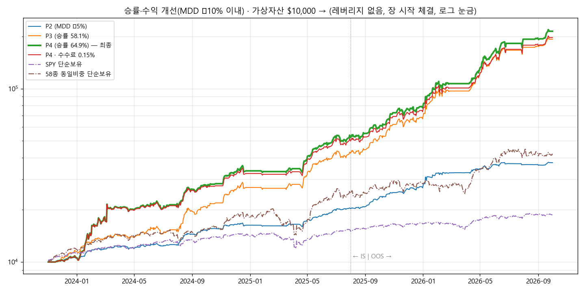

# 승률·수익 개선 — P4 보고서 (2026-10-04)

## 1. 결론
- **조건**: MDD −10% 이내(전체·IS·OOS), 레버리지 없음, 모든 매매 장 시작 가격(경로 무관), 최신 M·S·I·K 신호
- **P4**는 P3보다 승률과 수익이 모두 높습니다.

  | | P3 | **P4** |
  |---|---|---|
  | 수익(2023-11 ~ 2026-10) | +1,828% | **+2,043%** ($10,000 → $214,325) |
  | 승률 | 58.1% | **64.9%** |
  | MDD | −9.93% | **−9.65%** |
  | 청산 횟수 | 1,222 | **596**(잦은 매매 절반으로) |
  | 샤프 | 3.71 | 3.35 |
  | 수수료·슬리피지 0.15%일 때 | MDD −10.0%(경계 초과) | **+1,871%, MDD −9.7%(통과)** |

- **바뀐 점**: P3의 K 몫 매매 1,170건을 분석했더니 두 묶음이 손해였습니다.
  - K 비중 1% 이하로 산 307건: 승률 48%, −$591
  - 하루 만에 판 254건: 승률 51%, −$2,818
- 그래서 K 몫 규칙을 바꿨습니다.
  - **K 비중 2% 미만이면 새로 안 삽니다.**
  - **K 비중이 0이 된 날이 3거래일 이어져야 팝니다.**

  | P4 몫 | 거래 수 | 승률 | 실현이익 |
  |---|---|---|---|
  | K 몫 | 544 | 63.8% | $94,517 |
  | 모멘텀 몫 | 52 | 76.9% | $109,809 |

- 샤프가 3.71에서 3.35로 내려간 것은 K 종목을 더 오래 들고 있기 때문입니다. 수익과 승률을 얻은 대신 하루하루 출렁임이 조금 커졌습니다.

## 2. P4 로직 (`PRESETS["P4"]`, Kaggle 실행 셀 `STRATEGY="R1"` 그대로 P4로 실행)
1. **K 몫**: 최신 주식층(K v0.31) 배분비중 × 0.9를 보유합니다.
   - 비중 2% 미만이면 새로 사지 않습니다.
   - 비중 0이 3거래일 이어지면 장 시작에 팝니다.
2. **모멘텀 몫**: 5거래일마다 6-1 모멘텀 상위 2종을 각 15% 보유합니다(4위 안이면 유지).
3. **M 국면 0이면 전부 현금**입니다. 실적 발표 당일·전날에는 새로 안 사고, 들고 있으면 장 마감 전에 팝니다.

## 3. 탐색 과정 (U01 ~ U05, 63개 변형)
| 라운드 | 시험한 것 | 결과 |
|---|---|---|
| U01 | K 최소비중 1·2%, 0 연속 2·3일 뒤 매도, K 상위 N종, 3종목 로테이션 | 승률 61 ~ 64%로 상승. MDD는 −10.3 ~ −12.4%로 살짝 넘음 |
| U02 | 위 설정 + 비중 축소·낙폭 브레이크 | 최소2% + 로테16: +1,737%, 승률 62.2%, MDD −9.68% |
| U03 | **최소비중 × 0 연속일 × K 배율 × 모멘텀 몫** 격자 | **최소2% · 3일 · K0.9 · 각 15% = +2,043%, 승률 64.9%, MDD −9.65% (P4)** |
| U04 | K 매수에 상승 추세 조건, 실적 회피 끔, 주기·버퍼 | 추세 조건은 수익 크게 감소(+862 ~ 1,458%). 실적 회피를 끄면 MDD −13% → 유지 |
| U05 | P4 견고성 | 아래 표 |

## 4. P4 견고성
| 조건 | 수익 | MDD | 승률 | 판정 |
|---|---|---|---|---|
| **P4** | **+2,043%** | **−9.65%** | **64.9%** | ✅ |
| 봉 안 가격 순서 불리 | +2,047% | −9.71% | 65.2% | ✅ 경로 무관 |
| 수수료 0.15% / 슬리피지 0.15% | +1,871% / +1,872% | −9.69% / −9.70% | 64.0% / 63.7% | ✅ |
| K 최소비중 1% / 3% | +1,954% / +1,901% | −9.67% / −9.69% | 65.9% / 65.8% | ✅ |
| 0 연속 2일 / 4일 | +1,294% / +2,136% | −9.97% / −9.63% | 61.9% / 65.7% | ✅ |
| K 0.8 / 1.0 | +1,745% / +2,407% | −9.46% / −10.15% | 65.5% / 65.3% | ✅ / 경계 |
| 모멘텀 각 14% / 16% | +1,878% / +2,123% | −9.64% / −9.82% | 65.2% / 65.7% | ✅ |
| 유니버스 절반 a / b | +305% / +725% | −7.1% / −10.1% | 65.4% / 64.6% | 수익 크게 감소 |
| **M 국면 대신 SPY 규칙** | +739% | **−21.5%** | 61.4% | ❌ |
| **신호 하루 늦게** | +1,007% | **−17.2%** | 58.8% | ❌ |

## 5. 한계
1. **M·K 신호에 크게 기댑니다.**
   - M을 SPY 규칙으로 바꾸거나 신호가 하루 늦으면 MDD가 −17 ~ −22%가 됩니다.
   - 매일 장 전에 `results/reports/<날짜>/`가 갱신돼 있어야 합니다.
   - 두 모델 모두 이 기간을 보며 다듬은 최신 버전이라 과거 성과가 부풀어 있을 수 있습니다.
2. **사후 선택 편향**: 58종은 2026년에 고른 종목이고 이익의 73%가 SNDK·MU·WDC·DAVE·CRDO에서 나왔습니다.
3. **실시간 반영**: K 비중 0 연속 일수를 가상계좌 파일에 저장하게 했습니다. 실행기를 매일 새로 켜도 시뮬레이션과 같게 동작합니다(테스트로 확인).
4. **지금은 M이 '하락(위험회피)'**이라 전부 현금으로 대기합니다.

## 6. 파일
- `P4_결과.xlsx`: 차트, U 라운드 표, 자산곡선, 분기 수익률, P4 종목별·몫별 손익(승률 포함), 설정, 거래내역
- `자산곡선_P4.png`
