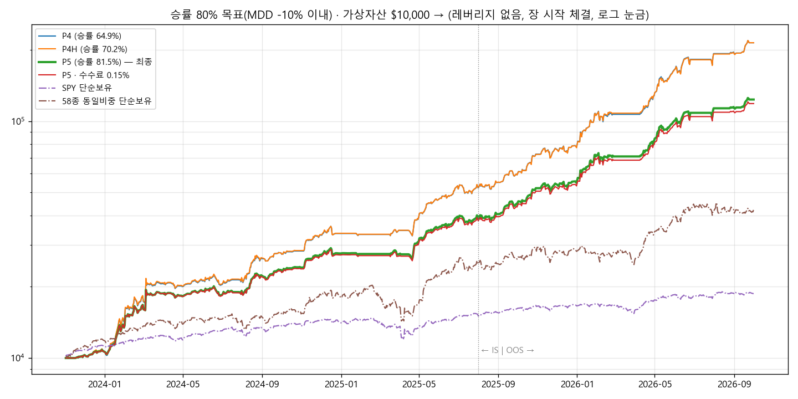

# 승률 80% 목표 — P5 보고서 (2026-10-04)

## 1. 결론
- **조건**: MDD −10% 이내(전체·IS·OOS), 레버리지 없음, 모든 매매 장 시작 가격(경로 무관), 최신 M·S·I·K 신호
- **승률 80%는 달성했습니다.** **P5**: 승률 **81.5%**, MDD **−9.91%**, 수익 **+1,134%** ($10,000 → $123,437)
- **수익 20,000%는 이번에도 도달하지 못했습니다.**
  - 레버리지 없이 MDD −10% 안에서 찾은 최고 수익은 여전히 P4 계열의 약 +2,040%입니다.
  - 승률을 80%로 올리면 MDD를 맞추느라 비중을 줄여야 해서 수익이 +1,134%로 내려갑니다.

  | | P4 | P4H (수익 우선) | **P5 (승률 우선, 추천)** |
  |---|---|---|---|
  | 수익(2023-11 ~ 2026-10) | +2,043% | +2,044% | **+1,134%** |
  | 승률 | 64.9% | 70.2% | **81.5%** |
  | MDD | −9.65% | −9.63% | **−9.91%** |
  | IS / OOS 수익 | +430% / +305% | +431% / +304% | +295% / +212% |
  | 청산 횟수 | 596 | 584 | 572 |
  | 샤프 | 3.35 | 3.36 | 3.28 |
  | 평균 이익 / 평균 손실 | +11.3% / −4.0% | — | +9.8% / **−8.8%** |

- **주의 — 승률이 올라간 만큼 손실 한 번이 커졌습니다.**
  - P4는 손실 209건, 평균 −4.0%였습니다.
  - P5는 손실 106건, 평균 −8.8%입니다. 이 중 100건이 손실 한도(7%) 근처에서 판 것입니다.
  - 작은 손실을 기다려 이익으로 바꾸는 대신, 끝내 회복하지 못한 종목은 더 크게 잃고 팝니다.
  - 따라서 승률 자체가 수익을 늘려 주지는 않습니다. 수익만 보면 P4H가 낫습니다.

## 2. P5 로직 (`PRESETS["P5"]`, Kaggle 실행 셀 `STRATEGY="R1"` 그대로 P5로 실행)
1. **K 몫**: 최신 주식층(K v0.31) 배분비중 × **0.7**을 보유합니다.
   - 비중 2% 미만이면 새로 사지 않습니다.
   - 비중 0이 3거래일 이어지면 팔 신호가 됩니다.
2. **모멘텀 몫**: 5거래일마다 6-1 모멘텀 상위 2종을 각 **12%** 보유합니다(4위 안이면 유지).
3. **본전 대기(새로 추가)**: 팔 신호가 났을 때 손실 중이면 바로 팔지 않습니다.
   - 본전(수수료 포함)을 넘으면 그때 팝니다.
   - 최대 20거래일 기다립니다.
   - **M 국면 0(위험회피)일 때와 실적 발표 때도** 손실 중인 종목은 들고 기다립니다. 이익 중인 종목은 이전처럼 팝니다.
   - 진입가 대비 **−7%**가 되면 기다리지 않고 바로 팝니다(손실 한도).
4. 실적 발표 당일·전날에는 새로 사지 않습니다.
5. 대기 시작일은 가상계좌 파일에 저장됩니다. 실행기를 매일 새로 켜도 시뮬레이션과 같게 동작합니다(테스트로 확인).

## 3. 탐색 과정 (T01 ~ T05, 57개 변형)
T01의 본전 대기(국면 1일 때만)를 적용한 뒤에 남은 손실 매도를 나눠 보니 **71%가 'M 국면 0 → 전부 현금' 일괄 정리**에서 나왔습니다. 그래서 그 시점에 손실 중인 종목을 들고 기다리는 방법을 중심으로 시험했습니다.

| 라운드 | 시험한 것 | 결과 |
|---|---|---|
| T01 | 본전 대기(국면 1일 때만), K 몫 이익 실현(5·8·10·12%), 고확신 K만 | 본전 대기 20일: +2,044%, 승률 70.2%(**P4H**). 이익 실현은 승률 ↑, 수익 크게 ↓(+620 ~ 960%) |
| T02 | **국면 0 때도 본전 대기** + 손실 한도 6 ~ 15%, 실적 때 보유 | 승률 76 ~ 91%, 수익 +1,600 ~ 1,890%. 대신 IS MDD −12 ~ −17%로 초과 |
| T03 | T02 설정의 비중 축소(K 0.55 ~ 0.8, 모멘텀 10 ~ 13%) | 승률 82 ~ 84%, MDD −9.2 ~ −13.9%, 수익 +600 ~ 1,110% |
| T04 | 손실 한도 6 ~ 8% × K 배율 × 모멘텀 몫 격자 | **손실 한도 7% · 실적 보유 · K0.7 · 각 12% = +1,134%, 승률 81.5%, MDD −9.91% (P5)** |
| T05 | P5 견고성 | 아래 표 |

## 4. P5 견고성
| 조건 | 수익 | MDD | 승률 | 판정 |
|---|---|---|---|---|
| **P5** | **+1,134%** | **−9.91%** | **81.5%** | ✅ |
| 봉 안 가격 순서 불리 | +1,130% | −9.91% | 81.6% | ✅ 경로 무관 |
| 수수료 0.15% / 슬리피지 0.15% | +1,087% / +1,055% | −10.34% / −10.32% | 81.4% / 81.1% | 경계(−10% 살짝 넘음) |
| 손실 한도 6% / 8% | +1,159% / +1,110% | −9.88% / −10.82% | 80.4% / 82.5% | ✅ / 경계 |
| 대기 10일 / 30일 | +1,134% / +1,134% | −9.93% / −9.89% | 80.9% / 81.6% | ✅ |
| K 0.65 / 모멘텀 각 11% | +1,037% / +1,047% | −9.48% / −9.64% | 81.4% / 81.6% | ✅ |
| 유니버스 절반 a / b | +192% / +425% | −7.6% / −8.0% | 80.9% / 81.2% | 승률 유지, 수익 크게 감소 |
| **M 국면 대신 SPY 규칙** | +518% | **−18.3%** | 77.8% | ❌ |
| **신호 하루 늦게** | +681% | **−13.5%** | 79.6% | ❌ |

- **승률 80%대는 여러 조건에서 유지됩니다.** 유니버스를 반으로 나눠도, 대기 일수나 손실 한도를 바꿔도 80% 이상입니다.
- **MDD는 비용에 민감합니다.** 비용이 2배면 −10.3%로 경계를 조금 넘습니다.

## 5. 한계
1. **20,000%는 레버리지 없이 도달하지 못했습니다.**
   - 지금까지 찾은 최고 수익은 1종목 모멘텀의 약 +8,700 ~ 10,000%이고, 이때 MDD는 −35%입니다.
   - MDD −10% 안에서는 약 +2,000%가 한계였습니다.
2. **M·K 신호 의존**: M을 SPY 규칙으로 바꾸거나 신호가 하루 늦으면 MDD가 −13 ~ −18%가 됩니다. 매일 장 전에 `results/reports/<날짜>/`가 갱신돼 있어야 합니다.
3. **손실 종목을 위험회피 국면·실적 발표 중에도 들고 갑니다.**
   - 손실 한도 7%가 있지만 장 시작 가격으로 팔기 때문에 갭 하락이면 더 잃을 수 있습니다.
4. **사후 선택 편향**: 58종은 2026년에 고른 종목입니다. 이익의 72%가 SNDK·MU·DAVE·WDC·CRDO에서 나왔습니다.
5. **지금은 M이 '하락(위험회피)'**이라 전부 현금으로 대기합니다.

## 6. 파일
- `P5_결과.xlsx` 시트 구성:
  - 차트
  - T 라운드 표
  - 자산곡선
  - 분기 수익률
  - P5 종목별·방식별·매도사유별 손익(승률 포함)
  - 설정
  - 거래내역
- `자산곡선_P5.png`
