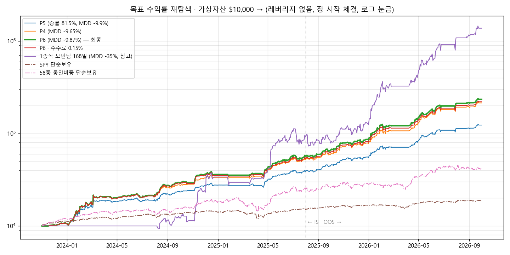

# 목표 수익률(20,000%) 재탐색 — P6 보고서 (2026-10-04)

## 1. 결론
- **조건**: 레버리지 없음(투자 합계 최대 100%), MDD −10% 이내(전체·IS·OOS), 모든 매매 장 시작 가격, 최신 M·S·I·K 신호
- **20,000%에는 이번에도 도달하지 못했습니다.**
  - MDD −10% 안 최고는 **P6 +2,240%**입니다. P4(+2,043%)보다 약 10% 높습니다.
  - MDD 제한을 없애도 찾은 최고는 **+13,670%**(1종목 모멘텀, MDD −35%)입니다.
  - 20,000%는 MDD를 얼마로 허용하든 레버리지 없이는 나오지 않았습니다.

  | | P5 (승률 우선) | P4 | **P6 (수익 우선)** |
  |---|---|---|---|
  | 수익(2023-11 ~ 2026-10) | +1,134% | +2,043% | **+2,240%** ($10,000 → $233,994) |
  | MDD | −9.91% | −9.65% | **−9.87%** |
  | IS / OOS 수익 | +295% / +212% | +430% / +305% | **+471% / +310%** |
  | 승률 | 81.5% | 64.9% | 65.2% |
  | 샤프 | 3.28 | 3.35 | **3.40** |
  | 수수료 0.15%일 때 | +1,087% (MDD −10.3%) | +1,871% (MDD −9.7%) | **+2,104% (MDD −9.84%)** |

- **Kaggle 실행 셀(`STRATEGY="R1"`)은 그대로 P5(승률 80%)를 실행합니다.**
  - 수익을 우선하려면 셀에서 `STRATEGY = "P6"`로 바꾸세요.

## 2. 왜 20,000%가 안 되는가 — 수익 한계선
### 빠른 근사로 보유 묶음을 섞어 본 결과
일별 시가 매매, M 국면 0이면 현금, 편도 비용 0.12%, 투자 합계 최대 100%로 계산했습니다.

| MDD 한도 | 근사로 찾은 최대 수익 | 그때의 조합 |
|---|---|---|
| −10% | +2,085% | K × 1.1 + 모멘텀 1위 20% (P6와 같은 방향) |
| −15% | +5,382% | K 상위 5종 동일비중 52% + 모멘텀 상위 2종 48% |
| −20% | +9,550% | K 상위 5종 52% + 모멘텀 1위 48% |
| 제한 없음 | +10,948% | 모멘텀 1위 1종목 100% |

### 이렇게 되는 이유
- **샤프가 부족합니다.**
  - 2.9년에 20,000%를 MDD −10% 안에서 내려면 샤프가 약 6.5 이상이어야 합니다.
  - 찾은 전략들의 샤프는 3.3 ~ 3.8이 한계였습니다.
- **집중도를 높이면 MDD가 함께 커집니다.**
  - 레버리지 없이 수익을 더 내는 방법은 비중을 1 ~ 2종목에 몰아주는 것뿐입니다.
  - 그러면 MDD가 −20 ~ −35%가 되고, 그래도 +11,000% 정도가 끝입니다.
- **효과가 없었던 방법**:
  - 변동성 목표: 출렁임이 크면 비중을 줄이는 방식인데, 수익이 MDD보다 더 많이 줄었습니다.
  - 낙폭 브레이크: 하락이 빠르게 와서 MDD가 거의 안 줄었습니다.
  - 종목 범위 확대(58종 → 176종): 수익이 오히려 줄었습니다.
- **2026년에 고른 58종이라서 가능한 수익입니다.**
  - 사후 선택이 없는 2023년 S&P100에서 같은 1종목 모멘텀은 +278 ~ 409%에 그쳤습니다.

## 3. P6 로직 (`PRESETS["P6"]`)
1. **K 몫**: 최신 주식층(K v0.31) 배분비중 × 0.9를 보유합니다.
   - 비중 2% 미만이면 새로 사지 않습니다.
   - 비중 0이 3거래일 이어지면 장 시작에 팝니다.
2. **모멘텀 몫**: 5거래일마다 **168일(최근 1달 제외) 수익률 1위 1종목**에 자산의 20%를 넣습니다. 2위 안이면 유지합니다.
   - P4는 126일 기준 상위 2종에 각 15%였습니다.
3. **M 국면 0이면 전부 현금**입니다. 실적 발표 당일·전날에는 새로 사지 않고, 들고 있으면 장 마감 전에 팝니다.

## 4. 탐색 과정 (S01 ~ S04, 68개 변형 + 근사 분석)
| 단계 | 시험한 것 | 결과 |
|---|---|---|
| 근사 분석 | 장중·밤사이 수익 분해, 보유 묶음 30종, 두 묶음 섞기, 변동성 목표, 종목 범위 확대 | 위 2장의 한계선 |
| S01 | 한계선 점들을 실제 시뮬레이션으로 확인 | K × 1.1 + 189일 1위 20%: +2,879%, MDD −11.1% |
| S02 | K 배율 × 1위 몫 × 기간 격자(24개) | **K0.9 · 1위 20% · 168일: +2,240%, MDD −9.87% (P6)** |
| S03 | 위 조합들 + 낙폭 브레이크 | MDD 안 줄어듦 → 제외 |
| S04 | P6 견고성 + MDD 제한 없는 1종목 모멘텀 | 아래 표 |

- **근사와 시뮬레이션 차이**: 1종목 모멘텀은 근사가 +10,800%인데 시뮬레이션은 +2,871%였습니다.
  - 실적 발표 회피가 큰 이익을 놓쳤습니다(예: 2025년 5월 DAVE 실적 후 +40%).
  - 리밸런싱이 매일이 아니라 5일마다라서 차이가 납니다.

## 5. P6 견고성
| 조건 | 수익 | MDD | 판정 |
|---|---|---|---|
| **P6** | **+2,240%** | **−9.87%** | ✅ |
| 봉 안 가격 순서 불리 | +2,231% | −9.83% | ✅ 경로 무관 |
| 수수료 0.15% / 슬리피지 0.15% | +2,104% / +2,064% | −9.84% / −9.86% | ✅ |
| 1위 몫 18% / 22% | +2,075% / +2,401% | −9.64% / −10.47% | ✅ / 경계 |
| 모멘텀 기간 147일 / 189일 | +1,675% / +2,028% | −9.69% / **−11.20%** | ✅ / ❌ |
| 2위까지 유지 → 3위까지 | +2,031% | −10.37% | 경계 |
| P6 + 본전 대기 20일 | +1,894% (승률 71.5%) | −9.83% | ✅ |
| 유니버스 절반 a / b | +272% / +840% | −6.9% / −10.1% | 수익 크게 감소 |
| **M 국면 대신 SPY 규칙** | +1,042% | **−23.3%** | ❌ |
| **신호 하루 늦게** | +1,177% | **−18.0%** | ❌ |

- **모멘텀 기간에 민감합니다**:
  - 189일이면 MDD가 −11.2%로 기준을 넘습니다.
  - 147일이면 수익이 +1,675%로 줄어듭니다.
  - P4보다 나은 정도(+10%)는 이 기간 선택의 운일 수 있습니다.

### MDD 제한 없는 1종목 모멘텀(참고, 추천하지 않음)
| 모멘텀 기간 | 수익 | MDD |
|---|---|---|
| 126일 (R1_5000) | +7,871% | −35.0% |
| 147일 | +6,803% | −35.0% |
| **168일** | **+13,670%** | −35.1% |
| 189일 | +4,401% | −36.2% |
| 168일 · 국면 무시 | +4,832% | −60.6% |

- 기간을 조금만 바꿔도 수익이 4,400 ~ 13,670%로 크게 흔들립니다.
- 수익은 몇 번의 종목 선택(DAVE, SNDK)이 맞았는지에 달려 있습니다.
- 처음 약 9개월(168일 + 21일)은 계산할 일봉 기록이 모자라 매매하지 않았습니다.

## 6. 한계
1. **20,000%는 레버리지 없이 도달하지 못했습니다.** 다음 중 하나가 바뀌지 않으면 같은 결론일 것입니다.
   - 레버리지 허용
   - 더 긴 기간
   - 새로운 수익원(샤프 6 이상)
2. **M·K 신호 의존**: SPY 규칙으로 바꾸거나 신호가 하루 늦으면 MDD가 −18 ~ −23%가 됩니다. 매일 장 전에 `results/reports/<날짜>/`가 갱신돼 있어야 합니다.
3. **사후 선택 편향**: 이익의 77%가 SNDK·MU·DAVE·WDC·STX에서 나왔습니다.
4. **지금은 M이 '하락(위험회피)'**이라 전부 현금으로 대기합니다.

## 7. 파일
- `P6_결과.xlsx` 시트 구성:
  - 차트
  - S 라운드 표
  - 자산곡선
  - 분기 수익률
  - P6 종목별·방식별·매도사유별 손익
  - 설정
  - 근사-변동성목표 표
  - 거래내역
- `자산곡선_P6.png`
