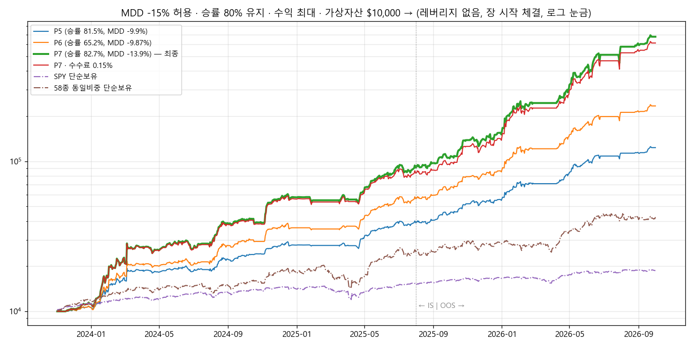

# MDD −15% 허용 · 승률 80% 유지 · 수익 최대 — P7 보고서 (2026-10-04)

## 1. 결론
- **조건**:
  - MDD −15% 이내(전체·IS·OOS)
  - 승률 80% 이상
  - 레버리지 없음(투자 합계 최대 100%)
  - 모든 매매 장 시작 가격, 최신 M·S·I·K 신호
- **P7**: 수익 **+6,667%**($10,000 → $676,708), MDD **−13.92%**, 승률 **82.7%**
  - 조건을 만족한 전략 중 수익이 가장 높습니다.
  - P5보다 수익이 약 6배입니다.
- **목표 20,000%에는 아직 미달입니다.**

  | | P5 (MDD −10%, 승률 우선) | P6 (MDD −10%, 수익 우선) | **P7 (MDD −15%, 승률 80%)** |
  |---|---|---|---|
  | 수익(2023-11 ~ 2026-10) | +1,134% | +2,240% | **+6,667%** |
  | IS / OOS 수익 | +295% / +212% | +471% / +310% | **+822% / +634%** |
  | MDD | −9.91% | −9.87% | **−13.92%** |
  | 승률 | 81.5% | 65.2% | **82.7%** |
  | 샤프 | 3.28 | 3.40 | 3.20 |
  | 수수료 0.15%일 때 | +1,087% | +2,104% | **+6,045% (MDD −14.1%, 승률 81.4%)** |

- **Kaggle 실행 셀(`STRATEGY="R1"`)은 이제 P7을 실행합니다.**

## 2. P7 로직 (`PRESETS["P7"]`)
1. **K 몫**: 최신 주식층(K v0.31) 배분비중 × **1.5**를 보유합니다.
   - 비중 2% 미만이면 새로 사지 않습니다.
   - 비중 0이 3거래일 이어지면 팔 신호가 됩니다.
2. **모멘텀 몫**: 5거래일마다 **168일(최근 1달 제외) 수익률 1위 1종목**에 자산의 **50%**를 넣습니다. 2위 안이면 유지합니다.
3. **현금 한도**: 두 몫을 합쳐 100%를 넘으면 남은 현금만큼만 삽니다. 레버리지는 쓰지 않습니다.
4. **본전 대기(P5와 같은 방식)**:
   - 팔 신호가 났을 때 손실 중이면, 본전을 넘을 때까지 최대 20거래일 기다립니다.
   - M 국면 0일 때와 실적 발표 때도 기다립니다.
   - 진입가 대비 **−8%**가 되면 바로 팝니다.
5. **M 국면 0이면 이익 중인 종목은 팔고 현금으로 갑니다.** 실적 발표 당일·전날에는 새로 사지 않습니다.

## 3. 탐색 과정 (Q01 ~ Q05, 73개 변형)
| 라운드 | 시험한 것 | 결과 |
|---|---|---|
| Q01 | 본전 대기 × K 배율 0.9 ~ 1.5 × 모멘텀 몫(상위 2 각 15% / 1위 25·35%) × 손실 한도 7·10% | 20개 중 19개가 조건 통과. 최고는 K1.3 · 1위 35%: +5,274% |
| Q02 | K 배율 1.3 ~ 2.0 × 1위 몫 35 ~ 50% | +5,200 ~ 6,700%에서 멈춤(현금 한도). 승률 79 ~ 81%로 경계 |
| Q03 | 승률 여유 만들기(손실 한도 8 ~ 10%, 대기 30·40일), 리밸런싱 주기 | **손실 한도 8%: +6,667%, 승률 82.7%, MDD −13.9% (P7)** |
| Q04 | P7 견고성 | 아래 표 |
| Q05 | 모멘텀 몫을 상위 2종으로 나누기 | +4,400 ~ 6,400%. 30%를 넘으면 MDD −15% 초과 → P7보다 못함 |

## 4. P7 견고성
| 조건 | 수익 | MDD | 승률 | 판정 |
|---|---|---|---|---|
| **P7** | **+6,667%** | **−13.92%** | **82.7%** | ✅ |
| 봉 안 가격 순서 불리 | +6,557% | −13.92% | 82.1% | ✅ 경로 무관 |
| 수수료 0.15% / 슬리피지 0.15% | +6,045% / +5,952% | −14.12% / −14.18% | 81.4% / 80.9% | ✅ |
| K 1.3 / 1.7 | +6,274% / +7,050% | −14.55% / −14.19% | 81.3% / 81.5% | ✅ |
| 1위 몫 45% / 55% | +5,723% / +6,635% | −13.92% / −13.88% | 82.4% / 82.4% | ✅ |
| 손실 한도 7% / 9% | +6,647% / +6,227% | −13.79% / −14.25% | 80.2% / 82.1% | ✅ |
| 대기 10일 / 30일 | +6,061% / +6,161% | −13.94% / −13.92% | 80.8% / 81.6% | ✅ |
| 모멘텀 기간 126일 / 147일 | +5,201% / +4,138% | −14.17% / −14.32% | 81.7% / 82.0% | ✅ |
| **모멘텀 기간 189일** | +5,344% | **−20.10%** | 81.5% | ❌ |
| 유니버스 절반 a / b | +981% / +4,007% | −13.3% / **−17.9%** | 81.9% / 81.1% | ✅ / ❌ |
| **M 국면 대신 SPY 규칙** | +2,895% | **−41.5%** | 79.8% | ❌ |
| **신호 하루 늦게** | +2,502% | **−20.2%** | 80.0% | ❌ |

## 5. 주의할 점
1. **이익이 SNDK 한 종목에 몰려 있습니다.**
   - 실현이익의 55%($369,333)가 SNDK에서 나왔습니다.
   - 상위 5종(SNDK·DAVE·MU·WDC·CRDO)이 82%입니다.
   - 58종은 2026년에 고른 종목이라 과거 성과가 부풀어 있을 수 있습니다.
2. **손실 한 번이 큽니다.**
   - 손실 78건의 평균은 −10.4%, 최대는 −27%(FTNT, 실적 발표를 안고 가다 급락)입니다.
   - 손실 한도 8%는 팔 신호가 난 뒤 기다리는 동안에만 적용됩니다.
   - 장 시작 가격으로 팔기 때문에 갭 하락이면 8%보다 더 잃습니다.
3. **모멘텀 1위에 50%를 넣어서, 그 종목 하나의 급락이 자산에 크게 영향을 줍니다.**
4. **M·K 신호 의존**: SPY 규칙으로 바꾸면 MDD −41%, 신호가 하루 늦으면 −20%입니다. 매일 장 전에 `results/reports/<날짜>/`가 갱신돼 있어야 합니다.
5. **모멘텀 기간에 민감합니다.** 189일이면 MDD −20%로 조건을 넘습니다.
6. **지금은 M이 '하락(위험회피)'**이라 전부 현금으로 대기합니다.

## 6. 파일
- `P7_결과.xlsx` 시트 구성:
  - 차트
  - Q 라운드 표
  - 자산곡선
  - 분기 수익률
  - P7 종목별·방식별·매도사유별 손익
  - 설정
  - 거래내역
- `자산곡선_P7.png`
