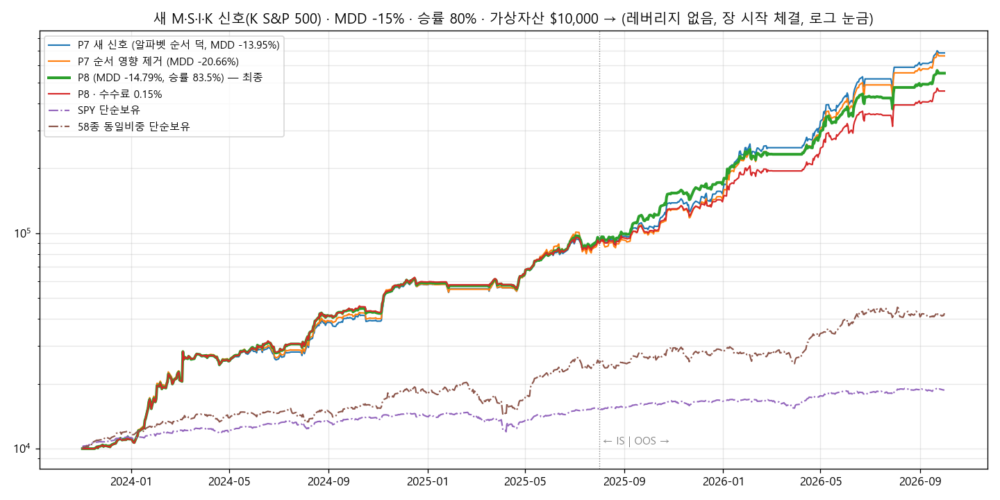

# 새 국면·섹터·산업·주식층 코드 대응 — P8 보고서 (2026-10-05)

## 1. 결론
- **최신 리포트**: M v1.85.0 · S v1.00.0 · I v0.65.0 · K v0.33.0 (`results/reports/2026-10-02/`)
  - 기존 방식 그대로 읽힙니다.
  - K v0.34.0은 코드만 올라와 있고 리포트는 아직 없습니다. 나오면 자동으로 최신 버전을 씁니다.
- **가장 큰 변화**: K가 58종이 아니라 **S&P 500 전 종목**에서 골라 배분합니다.
  - 지금 리포트 기준으로 58종 밖 28종과 섹터 ETF 11개에 배분합니다.
  - 그래서 K 배분 종목을 자동으로 거래 대상에 넣게 고쳤습니다.
- **새 추천 P8**: 수익 **+5,419%**, MDD **−14.79%**, 승률 **83.5%**
  - 조건(MDD −15%, 승률 80%)을 지킵니다.
  - 시세가 들어오는 순서와 결과가 무관하도록 고쳤습니다.
- **⚠️ 이전 P7 수치 정정**:
  - P7의 MDD −13.92%는 현금이 모자랄 때 티커 알파벳 순서로 먼저 사는 덕이었습니다.
  - 처리 순서를 바꾸면 MDD −15.7 ~ −19.9%, 순서 영향을 없애면 **−20.7%**로 조건을 넘습니다.

  | | P7 (이전 보고) | P7 순서 영향 제거 | **P8 (새 추천)** |
  |---|---|---|---|
  | 수익 | +6,755% (새 신호) | +6,540% | **+5,419%** ($10,000 → $551,905) |
  | MDD | −13.95% | **−20.66%** | **−14.79%** |
  | 승률 | 81.2% | 81.5% | **83.5%** |
  | 처리 순서를 바꾸면 | MDD −15.7 ~ −19.9% | 같음 | **같음** |
  | 수수료 0.15%일 때 | — | — | +4,463% (MDD −14.90%) |

- **Kaggle 실행 셀(`STRATEGY="R1"`)은 이제 P8을 실행합니다.**

## 2. 새 코드에 맞춰 바꾼 것
1. **K 배분 종목을 자동으로 거래 대상에 추가합니다** (`k_symbols`).
   - 2023-11 이후 K 비중이 한 번이라도 2% 이상이었던 종목을 58종에 더합니다.
   - 지금은 16개가 더해져 74종입니다: PLTR · NFLX · LITE · JBL · GDDY · TER · VRSN · VST · NWS · XLK · XLU · XLRE · XLC · XLI · XLP · XLY
   - K v0.34의 '작게 넣기' 종목(2% 미만)은 매매하지 않습니다.
   - 레버리지 ETF는 항상 뺍니다.
2. **K의 섹터 ETF 열 이름을 실제 티커로 읽습니다.** 예: `ETF_XLK` → `XLK`
3. **새 종목의 키움 거래소 코드를 표로 넣었습니다.** 표에 없는 종목은 실행 중에 야후에서 조회합니다.
4. **모멘텀 후보는 기존 58종으로 유지합니다** (`rot_base_only`).
   - 확장된 목록은 미래에 K가 고를 종목까지 담고 있습니다. 모멘텀이 이 목록에서 고르면 사후 선택이 생깁니다.
   - 실제로 확장 목록에서 고르게 하면 +3,970%로 수익도 더 낮았습니다.
5. **매수 순서를 고정했습니다** (`batch_buys`).
   - 같은 순간 들어온 시세는 매도를 먼저 모두 처리합니다.
   - 매수는 모아서 모멘텀 몫 → K 비중 큰 순으로 처리합니다.
   - 시뮬레이션, 실시간 야후 시세, 키움 웹소켓 모두 같은 방식입니다.
6. **신호 날짜 규칙은 그대로입니다.**
   - K 13r 시트의 '그날 수익'은 13c의 전날 행 비중으로 가장 잘 맞습니다. 상관 0.894, 같은 날 행이면 0.766입니다.
   - 그래서 D일에는 날짜가 D보다 앞선 행을 씁니다. 신호를 늦게 쓰지도, 미래 정보를 쓰지도 않습니다.
7. **K의 새 '다음날 하락확률' 열도 읽습니다** (`k_drop1_max` 옵션).
   - 보유 종목 기준으로 확률이 낮을수록 다음날 수익이 높았습니다(하위 20% +0.41%, 상위 20% +0.18%).
   - 하지만 매수 필터로 쓰면 수익이 +2,200 ~ 2,800%로 크게 줄어 P8에서는 쓰지 않습니다.

## 3. P8 로직 (`PRESETS["P8"]`)
1. **K 몫**: K(v0.33+) 배분비중 × 1.5를 보유합니다. 58종 밖 종목과 섹터 ETF도 포함합니다.
   - 비중 2% 미만이면 새로 사지 않습니다.
   - 비중 0이 3거래일 이어지면 팔 신호가 됩니다.
2. **모멘텀 몫**: 5거래일마다 58종 중 168일(최근 1달 제외) 수익률 1위 1종목에 자산의 **35%**를 넣습니다.
3. **본전 대기**:
   - 팔 신호가 났을 때 손실 중이면, 본전을 넘을 때까지 최대 20거래일 기다립니다.
   - M 국면 0일 때와 실적 발표 때도 기다립니다.
   - 진입가 대비 −8%가 되면 바로 팝니다.
4. **같은 순간에는 매도 먼저**, 매수는 모멘텀 → K 비중 큰 순으로 합니다.
   - 투자 합계는 현금 한도 안입니다. 레버리지는 쓰지 않습니다.
5. **M 국면 0이면 이익 중인 종목은 팝니다.** 실적 발표 당일·전날에는 새로 사지 않습니다.

## 4. 탐색 과정 (G01 ~ G10, 120개 변형)
| 라운드 | 시험한 것 | 결과 |
|---|---|---|
| G01 | 새 신호로 P7 / K 확장 종목 따라가기 / 하락확률 필터 | 58종만 +6,755%. K 확장(모멘텀 58종) +5,300%. 하락확률 필터는 +2,200 ~ 2,800%로 감소 |
| G02 | K 확장 조건에서 K 배율 × 1위 몫 | +4,500 ~ 8,700%로 들쭉날쭉 → 원인 조사 |
| G03 · G06 | K 몫을 남은 현금에 맞춤(`k_fit`) | 수익 +2,300 ~ 3,800%. 그래도 순서에 따라 MDD가 흔들림 |
| G04 · G05 | **처리 순서 점검** | P7: 알파벳순 −13.95% / 역순 −19.93% / 무작위 −15.7 ~ −18.1% → **순서 효과 확인** |
| G07 | **매도 먼저 · 매수 순서 고정(`batch_buys`)** | 어떤 순서로 넣어도 결과가 완전히 같음. 이때 P7은 MDD −20.66% |
| G08 · G09 | 순서 고정 조건에서 K 배율 × 1위 몫 다시 맞추기 | **K × 1.5 · 1위 35%: +5,419%, MDD −14.79%, 승률 83.5% (P8)** |
| G10 | P8 견고성 | 아래 표 |

## 5. P8 견고성
| 조건 | 수익 | MDD | 승률 | 판정 |
|---|---|---|---|---|
| **P8** | **+5,419%** | **−14.79%** | **83.5%** | ✅ |
| 처리 순서 무작위 | +5,419% | −14.79% | 83.5% | ✅ 순서 무관 |
| 봉 안 가격 순서 불리 | +4,632% | −14.75% | 83.6% | ✅ |
| 수수료 0.15% / 슬리피지 0.15% | +4,463% / +5,493% | −14.90% / −14.90% | 83.6% / 82.0% | ✅ |
| 58종 절반 a / b (+K 확장 종목) | +854% / +3,170% | −13.6% / −14.3% | 83.3% / 82.8% | ✅ (수익 크게 감소) |
| 모멘텀 기간 126일 / 147일 | +3,879% / +3,359% | −14.75% / −14.78% | 83.2% / 84.7% | ✅ |
| **모멘텀 기간 189일** | +4,387% | **−16.22%** | 84.3% | ❌ |
| K 확장 안 함(58종만) | +5,518% | −15.33% | 82.4% | 경계 |
| **M 국면 대신 SPY 규칙** | +1,735% | **−35.3%** | 81.1% | ❌ |
| **신호 하루 늦게** | +2,075% | **−17.3%** | 80.5% | ❌ |

## 6. 주의할 점
1. **MDD가 −15% 경계에 가깝습니다.**
   - 주변 설정(K 1.6배, 1위 40% 등)은 −15.1 ~ −15.5%로 조금 넘습니다.
   - 실거래에서 −15%를 넘을 수 있다고 보셔야 합니다.
2. **이익이 SNDK에 몰려 있습니다.** 실현이익의 48%가 SNDK, 상위 5종이 81%입니다. 58종은 2026년에 고른 종목입니다.
3. **K 확장 종목의 기여는 작습니다.** 52번 팔아 승률 90.4%, +$16,772였고 대부분 XLK와 PLTR입니다.
4. **손실 한 번이 큽니다.** 평균 손실 −10.4%, 최대 −27.3%입니다. 손실 한도 8%는 팔 신호가 난 뒤에만 적용되고, 갭 하락이면 더 잃습니다.
5. **M·K 신호와 그 시점에 크게 기댑니다.** 매일 장 전에 `results/reports/<날짜>/`가 갱신돼 있어야 합니다.
6. **지금은 M이 '하락(위험회피)'**이라 전부 현금으로 대기합니다.

## 7. 파일
- `P8_결과.xlsx` 시트 구성:
  - 차트
  - G 라운드 표
  - 자산곡선
  - 분기 수익률
  - P8 종목별·방식별·매도사유별 손익
  - 설정
  - 거래내역
- `자산곡선_P8.png`
