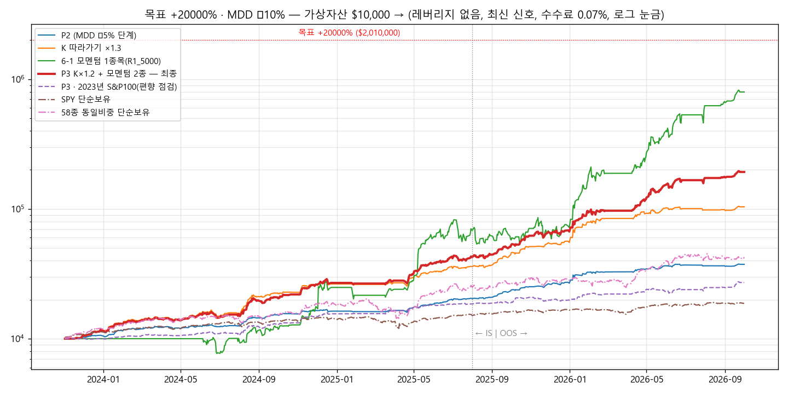

# 목표 +20000% · MDD −10% 이내 — 탐색 보고서 (2026-10-04)

## 1. 결론
- **목표** (기간 2023-11 ~ 2026-10)
  - 누적 수익 +20000% 이상(약 201배, 연 520% 속도)
  - 전체·IS·OOS 모든 기간 MDD −10% 이내
  - 거래 횟수는 자유, 레버리지 없음, 수수료 0.07%
- **20000%는 도달하지 못했습니다.**
  - MDD −10% 안에서 찾은 최고는 **P3 +1,828%**(약 19배)로, 목표의 약 1/11입니다.
  - MDD 제한을 없애도 최고는 1종목 모멘텀 +7,871 ~ 10,123%(MDD −35%)였습니다.
- **최종 P3: +1,828%** ($10,000 → $192,797)
  - MDD −9.93%, 샤프 3.71
  - IS +327%(MDD −9.9%) / OOS +351%(MDD −9.9%)
  - 이전 P2(+274%, MDD −4.9%)보다 6.7배 높습니다. SPY는 +87%(MDD −19%)였습니다.
  - **모든 매매를 장 시작 가격으로** 해서 봉 안 가격 순서 가정과 결과가 무관합니다(가격 순서가 불리해도 +1,787%).
- **이익 구성**:
  | 구분 | 실현이익 | 거래 수 |
  |---|---|---|
  | 모멘텀 몫 | $113,705 | 52회 |
  | K 따라가기 몫 | $69,092 | 1,170회 |

  상위 5종목(SNDK·MU·WDC·CRDO·DAVE)이 이익의 78%입니다.

## 2. P3 로직 (`PRESETS["P3"]`, 실행 셀의 `STRATEGY="R1"` 그대로 P3로 실행)
1. **K 따라가기 몫**: 최신 주식층(K v0.31) 리포트의 일별 배분비중 × 1.2만큼 보유합니다. 비중이 0이 되면 장 시작에 팝니다.
2. **모멘텀 몫**
   - 5거래일마다 6-1 모멘텀(126일 수익률, 최근 21일 제외) **상위 2종을 각 18%** 보유합니다.
   - 4위 안에 있으면 계속 보유합니다.
3. **M 국면 0이면 전부 현금**입니다. 실적 발표 당일·전날에는 그 종목을 새로 사지 않고, 들고 있으면 장 마감 전에 팝니다.
4. 모든 사고팖은 장 시작 가격(09:30)으로 합니다. 거래일 47%에 거래가 있었습니다(청산 1,222회).

## 3. 탐색 과정 (V01 ~ V05, 62개 변형)
| 라운드 | 시험한 것 | 결과 |
|---|---|---|
| V01 | 모멘텀 로테이션에 K를 위험 필터로(K 비중 0이면 제외·매일 매도) | 오히려 악화(+394 ~ 2,864%, MDD −20 ~ −35%). K가 급등주를 일찍 내보냄 |
| V02 | **K 따라가기 + 모멘텀 몫**, 변동성 맞춤, K 배율 1.3·1.6 | K + 모멘텀 2종 각 20%: +2,112%, MDD −12.4%. K×1.3: +938%, MDD −10.5% |
| V03 | 몫 15 ~ 20%, 3종목, 급락 정리, 낙폭 브레이크·한도, 주기, 실적 회피 | +1,366 ~ 2,474%지만 MDD −10.9 ~ −14% |
| V04 | MDD −10% 경계 촘촘히(실적 회피 + 몫 16 ~ 20% + K 배율) | **K×1.2 + 2종 각 18% = +1,828%, MDD −9.93% (P3)** |
| V05 | P3 견고성 | 아래 표 |

## 4. P3 견고성
| 조건 | 전체 수익 | MDD | 판정 |
|---|---|---|---|
| **P3** | **+1,828%** | **−9.93%** | MDD 통과 |
| 봉 안 가격 순서 불리 | +1,787% | −9.92% | 같음(경로 무관) |
| 수수료 0.15% / 슬리피지 0.15% | +1,579% / +1,538% | −10.02% / −10.03% | 경계 |
| 모멘텀 몫 16% / 20% | +1,619% / +1,951% | −9.87% / −10.96% | |
| K 배율 1.1 / 1.3 | +1,606% / +1,872% | −9.96% / −11.42% | |
| 모멘텀 100일 / 150일 | +1,485% / +1,457% | −9.95% / −9.90% | 통과 |
| 유니버스 절반 a / b | +422% / +608% | −8.6% / −9.5% | 통과(수익 감소) |
| **M 국면 대신 SPY 규칙** | **+846%** | **−23.9%** | ❌ M 의존 큼 |
| **신호 하루 늦게** | **+980%** | **−16.4%** | ❌ |
| **2023년 S&P 100 종목** | **+171%** | −8.1% | 편향 점검(K 비중이 없는 종목이라 모멘텀 몫만 거래) |

## 5. 20000%가 안 되는 이유와 한계
1. **이 기간·종목에서 가능한 상한**: 레버리지 없이는 MDD를 무시해도 최고가 약 +10,000%(1종목 모멘텀, MDD −35%)였습니다.
   - 20000%는 경로 무관 설계에서 어떤 조합으로도 나오지 않았습니다.
   - 시간봉 경로 가정에 기대면 더 큰 숫자가 나오지만, 5분봉 점검에서 사라지는 가짜 수익이라 쓰지 않았습니다(MDD5 보고서 참고).
2. **사후 선택 편향**: 58종은 2026년에 고른 종목이고 이익의 78%가 이 기간 급등주 5종에서 나왔습니다. 시작 시점에 정해진 S&P 100에서는 +171%입니다.
3. **M·K 신호 의존**: 이 기간을 보며 다듬은 최신 모델입니다.
   - M을 SPY 규칙으로 바꾸면 MDD −24%, 신호가 하루 늦으면 −16%가 됩니다.
   - 매일 장 전에 리포트(`results/reports/<날짜>/`)가 갱신돼 있어야 합니다.
4. **MDD −10%가 경계입니다.** 비용이 늘면 바로 −10%를 넘습니다.
5. **지금은 M이 '하락(위험회피)'**이라 P3는 전부 현금으로 기다립니다.

## 6. 새로 추가한 기능 (`Config`)
- `entry_mode="k+rot"`: K 따라가기 몫과 모멘텀 몫을 함께 운용
  - `k_rot_scale`: K 몫 배율
  - `rot_pct`: 모멘텀 몫 비중
- `rot_vol_target`: 변동성 맞춤 비중
- `rot_score="k"`: K 비중 순 로테이션
- `rot_daily_filter`: 로테이션 보유 종목이 S·I·K 필터에서 빠지면 바로 매도
- `k_strict`: K가 전부 현금이면 매수 대상 없음
- 기본값은 모두 꺼져 있어 이전 전략(C0·A·N2·R1_5000·P1·P2)이 그대로 재현됩니다.

## 7. 파일
- `R20K_결과.xlsx`: 차트, V 라운드 표, 자산곡선, 분기 수익률, P3 종목별·방식별 손익, 설정, 거래내역
- `자산곡선_R20K.png`
